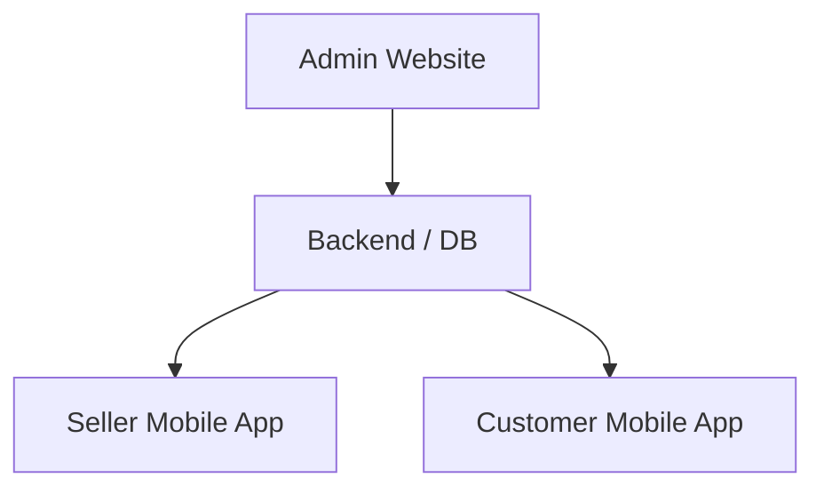

# Zoda WRS

Water Refilling Station system — **Admin Website**, **Backend / DB**, **Seller Mobile App**, at **Customer Mobile App**.

## System structure

```
                    ┌─────────────────────────────────────┐
                    │           ADMIN WEBSITE             │
                    │  Master Admin · Staff Management    │
                    │  POS · Inventory · Sales Reports    │
                    │  Analytics · Customer Management    │
                    └─────────────────┬───────────────────┘
                                      │
                    ┌─────────────────▼───────────────────┐
                    │           BACKEND / DB              │
                    │  Authentication · Users / Roles     │
                    │  Products · Orders · Payments       │
                    │  Inventory · Customers              │
                    │  Notifications · Sales              │
                    └─────────┬───────────────┬───────────┘
                              │               │
              ┌───────────────▼───┐   ┌───────▼──────────────┐
              │ SELLER MOBILE   │   │ CUSTOMER MOBILE APP  │
              │ Orders          │   │ Home · Products      │
              │ Delivery        │   │ Checkout             │
              │ Customers       │   │ Order History        │
              │ Notifications   │   │ Profile              │
              │ Profile         │   │                      │
              └─────────────────┘   └──────────────────────┘
```



| Layer | Modules |
| --- | --- |
| **Admin Website** | Master Admin, Staff Management, POS, Inventory, Sales Reports, Analytics, Customer Management |
| **Backend / DB** | Authentication, Users / Roles, Products, Orders, Payments, Inventory, Customers, Notifications, Sales |
| **Seller Mobile App** | Orders, Delivery, Customers, Notifications, Profile |
| **Customer Mobile App** | Home, Products, Checkout, Order History, Profile |

## Monorepo map

| Folder | Role sa bagong structure |
| --- | --- |
| `admin-web/` | Admin Website (Vite + Supabase — POS, inventory, reports, staff, analytics) |
| `supabase/` | Backend / DB (Postgres, Auth, Realtime, RLS, Edge Functions) |
| `mailer-api/` | Password-reset email (tumutulong sa Authentication) |
| `seller-app/` | Seller Mobile App (Expo SDK 55) |
| `customer-app/` | Customer Mobile App (Expo SDK 55) |
| `customer-web/` | Legacy mobile-first web customer UI — papalitan ng `customer-app` bilang primary customer channel |

### Migration note (current code → target)

Ang **seller mobile app** ay naka-focus sa **Orders, Delivery, Customers, Notifications (Alerts), Profile**. POS, inventory, sales reports, at staff approval — sa **Admin Website**. Ang customer flows ay sa **Customer Mobile App**.

---

## 1) Backend / DB (Supabase)

1. Create a Supabase project.
2. Run the SQL in `supabase/schema.sql` (Supabase Dashboard → SQL Editor).
3. Enable Realtime for tables (Dashboard → Database → Replication):
   - `public.orders`
   - `public.order_items`
   - `public.products`
   - `public.ewallet_accounts`

### Storage bucket (logos + QR)

Create a public bucket named **`wrs-assets`** in Supabase Storage.

### Seller / staff accounts

After register (`profiles` row), set role and team as needed:

```sql
update public.profiles set role = 'seller' where user_id = '<YOUR_AUTH_UID>';
```

Master admin (store owner) at staff approval — see `supabase/schema.sql` at seller app Profile → Manage accounts.

Push notifications: `supabase/functions/README.md`.

---

## 2) Admin Website

Web dashboard sa `admin-web/` — Master Admin, Staff Management, POS, Inventory, Sales Reports, Analytics, Customer Management. **Same Supabase project** as the mobile apps (shared products, orders, staff, POS sales; Realtime sync).

1. Copy `admin-web/.env.local.example` → `admin-web/.env.local`
2. Set `VITE_SUPABASE_URL` and `VITE_SUPABASE_ANON_KEY` (same as seller/customer).
3. Run:

```bash
cd admin-web
npm install
npm run dev
```

Sign in with the **store owner** account. Staff use the Seller mobile app only.

See `admin-web/README.md`.

---

## 3) Seller Mobile App (Expo SDK 55)

Field at store operations: orders, delivery, customers, notifications, profile.

1. Copy env (same Supabase project as admin / customer):

```bash
cd seller-app
copy .env.example .env
npm install
npm run start
```

Use `npx expo start -c` after changing `.env` (clear Metro cache).

---

## 4) Customer Mobile App (Expo SDK 55)

Primary customer channel: home, products/order, checkout, order history, profile.

```bash
cd customer-app
copy .env.example .env
npm install
npm run start
```

(Same `EXPO_PUBLIC_SUPABASE_*` values as seller-app and admin `VITE_*` keys.)

---

## 5) Customer website (legacy)

Optional Vite app sa `customer-web/` — same Supabase env pattern. Para sa bagong structure, gamitin ang **Customer Mobile App**; panatilihin lang kung kailangan pa ng web fallback.

```bash
cd customer-web
# .env.local.example → .env.local (VITE_SUPABASE_*)
npm run dev
```
